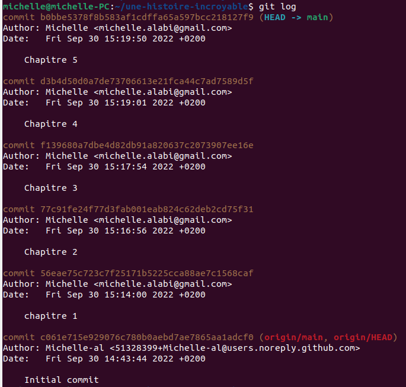

# Preuve de travail

commit b0bbe5378f8b583af1cdffa65a597bcc218127f9 (HEAD -> main)
Author: Michelle <michelle.alabi@gmail.com>
Date:   Fri Sep 30 15:19:50 2022 +0200

    Chapitre 5

commit d3b4d50d0a7de73706613e21fca44c7ad7589d5f
Author: Michelle <michelle.alabi@gmail.com>
Date:   Fri Sep 30 15:19:01 2022 +0200

    Chapitre 4

commit f139680a7dbe4d82db91a820637c2073907ee16e
Author: Michelle <michelle.alabi@gmail.com>
Date:   Fri Sep 30 15:17:54 2022 +0200

    Chapitre 3

commit 77c91fe24f77d3fab001eab824c62deb2cd75f31
Author: Michelle <michelle.alabi@gmail.com>
Date:   Fri Sep 30 15:16:56 2022 +0200

    Chapitre 2

commit 56eae75c723c7f25171b5225cca88ae7c1568caf
Author: Michelle <michelle.alabi@gmail.com>
Date:   Fri Sep 30 15:14:00 2022 +0200

    chapitre 1

commit c061e715e929076c780b0aebd7ae7865aa1adcf0 (origin/main, origin/HEAD)
Author: Michelle-al <51328399+Michelle-al@users.noreply.github.com>
Date:   Fri Sep 30 14:43:44 2022 +0200

    Initial commit

